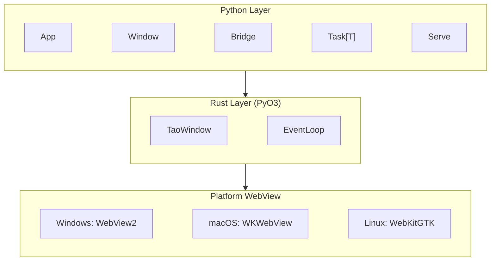

<p align="center">
  <h1 align="center">LumiView</h1>
  <p align="center">
    <strong>Pythonic webview desktop app framework — lightweight, out-of-the-box, async-first.</strong>
  </p>
  <p align="center">
    <a href="https://pypi.org/project/lumiview/"></a>
    <a href="https://pypi.org/project/lumiview/"></a>
    <a href="https://github.com/xiaosuawa/LumiView/blob/main/LICENSE"></a>
  </p>
  <p align="center">
    <a href="README_zh.md">中文</a>
  </p>
</p>

---

> ⚠️ **Early Development Stage — APIs May Change**
>
> LumiView is currently in **pre-alpha**. The API is functional but **not yet stable** — method names, parameter structures, and import paths may change between dev releases. We use dev releases to gather early feedback while retaining the flexibility to adjust the API.
>
> **Early adopters welcome!** Try building an app with it and tell us what works well and what doesn't. Your feedback will directly shape the final stable API. When upgrading, please check the changelog and be prepared to adjust your code.

---

## What is LumiView?

LumiView is an app development framework focused on system webviews. At the core layer, it wraps [tao](https://github.com/tauri-apps/tao) and wry (via [wryview](https://github.com/xiaosuawa/wryview)); at the top layer, it provides a clean, out-of-the-box, async-first Python API.

### Architecture



**Threading model:** Main thread (event loop + native ops) → Async thread (asyncio + user coroutines) → Thread pool (synchronous code).

## Documentation

- [Getting Started](docs/getting-started.md)
- [Architecture & Threading Model](docs/architecture.md)
- [Custom Plugins](docs/plugins.md)
- [Third-Party Integrations](docs/integrations.md)
- [Serve Protocol](docs/serve.md)

## Installation

```bash
pip install --pre lumiview
```

## Quick Start

```python
from lumiview import App, Window, WindowOptions

app = App(name="HelloLumiView")

async def main():
    win = await Window.create(WindowOptions(
        title="Hello LumiView!",
        url="https://example.com",
        width=900, height=640,
        devtools=True,
    ))
    title = await win.eval_js("document.title")
    print(f"Page title: {title}")

app.run(main)
```

## Key Features

- **🧵 Unified async/sync** — All cross-thread / async operations return `Task`. `await`, `.result()`, or `.on_done()` — same API, your choice.
- **🌉 JS ↔ Python Bridge** — Expose Python functions to JS via `window.lumiview.invoke()`. No HTTP server, no manual serialization required.
- **🪟 Native window effects** — Acrylic, Mica, Vibrancy via `window-vibrancy`.
- **🎨 Custom titlebar** — Declarative `data-lumiview-drag-region` drag areas + built-in `lumiview.window.*` JS API (minimize / maximize / close).
- **📁 Static serving & WSGI & ASGI** — Directly load local files, proxy to WSGI apps (Flask, Django, etc.), or run FastAPI/Starlette apps without external servers.

For runnable code, see the [`examples/`](examples/) directory.

## Examples

| Example | Description |
|---|---|
| [`hello_world.py`](examples/hello_world.py) | Minimal app — create window, load URL (async) |
| [`hello_world_sync.py`](examples/hello_world_sync.py) | Same as above, using `.result()` — pure synchronous style |
| [`bridge_demo.py`](examples/bridge_demo.py) | JS ↔ Python IPC — sync/async commands, error handling |
| [`multi_window.py`](examples/multi_window.py) | Multi-window + shared WebContext |
| [`custom_titlebar.py`](examples/custom_titlebar.py) | Frameless window + native effects + drag regions |
| [`events.py`](examples/events.py) | App/Window hook events + JS event emission |
| [`fastapi_demo.py`](examples/fastapi_demo.py) | FastAPI running via `source=ASGI(...)` |

## Development Status

- [x] Window management (TaoWindow + Window)
- [x] WebView embedding (wryview)
- [x] JS ↔ Python Bridge (invoke/listen IPC)
- [x] Event class system (WindowEvent / AppEvent)
- [x] Unified async/sync `Task` interface
- [x] Static file serving + WSGI proxy
- [x] ASGI adapter (FastAPI, Starlette, etc.)
- [x] Native window effects (Acrylic / Mica / Vibrancy)
- [x] Custom titlebar
- [ ] API stabilization (may 0.2.x)
- [ ] Complete documentation site

## Contributing

This is an early-stage project — **your feedback is crucial**.

- 🐛 [Report Bugs](https://github.com/xiaosuawa/LumiView/issues)
- 💡 [Share Ideas](https://github.com/xiaosuawa/LumiView/discussions)
- 🔧 [Contribution Guide](CONTRIBUTING.md)

Please read [CONTRIBUTING.md](CONTRIBUTING.md) before submitting PRs — the API is still in flux and significant changes require prior discussion.

## License

Copyright (c) 2026 Xiaosu.

Distributed under the terms of the [Mozilla Public License Version 2.0](https://github.com/xiaosuawa/LumiView/blob/main/LICENSE).
