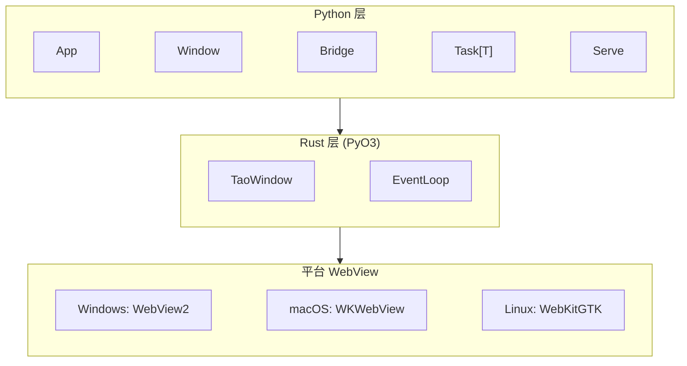

<p align="center">
  <h1 align="center">LumiView</h1>
  <p align="center">
    <strong>Pythonic 的 WebView 桌面App开发框架 — 轻量、开箱即用、异步优先。</strong>
  </p>
  <p align="center">
    <a href="https://pypi.org/project/lumiview/"></a>
    <a href="https://pypi.org/project/lumiview/"></a>
    <a href="https://github.com/xiaosuawa/LumiView/blob/main/LICENSE"></a>
  </p>
  <p align="center">
    <a href="README.md">English</a>
  </p>
</p>

---

> ⚠️ **早期开发阶段 — API 可能变动**
>
> LumiView 目前处于**alpha**阶段。API 已可用但**尚未完全稳定**——方法名、参数结构、导入路径仍可能在版本间调整。我们通过 alpha 版本收集早期反馈，同时保留灵活调整 API 的权利。
>
> **欢迎早期体验者！** 尝试用它构建应用，然后告诉我们哪里好用、哪里不好用。你的反馈将直接塑造最终的稳定 API。升级时请关注变更日志并做好调整代码的准备。

---

## LumiView 是什么？

LumiView 是一个专注于系统 WebView 的 App 开发框架。底层封装了 [tao](https://github.com/tauri-apps/tao) 和 wry (基于 [wryview](https://github.com/xiaosuawa/wryview))，上层提供简洁开箱即用的 async-first Python API 。

### 架构



**线程模型：** 主线程（事件循环 + 原生操作）→ 异步线程（asyncio + 用户协程）→ 线程池（同步代码）。

## 文档

- [快速入门](docs/getting-started.md)
- [架构与线程模型](docs/architecture.md)
- [自定义插件](docs/plugins.md)
- [第三方集成](docs/integrations.md)
- [Serve 协议](docs/serve.md)

## 安装

```bash
pip install lumiview
```

## 快速开始

```python
from lumiview import App, Window, WindowOptions

app = App(name="HelloLumiView")

async def main():
    win = await Window.create(WindowOptions(
        title="Hello LumiView!",
        url="https://example.com",
        width=900, height=640,
        devtools=True,
    ))
    title = await win.eval_js("document.title")
    print(f"Page title: {title}")

app.run(main)
```

## 核心特性

- **🧵 统一 async/sync** — 所有跨线程/异步操作返回 `Task`。`await`、`.result()` 或 `.on_done()`，同一套 API，自由选择。
- **🌉 JS ↔ Python Bridge** — Python 函数通过 `window.lumiview.invoke()` 暴露给 JS。无需 HTTP 服务器，无需手动序列化。
- **🪟 原生窗口效果** — Acrylic、Mica、Vibrancy `window-vibrancy`。
- **🎨 自定义标题栏** — 声明式 `data-lumiview-drag-region` 拖动区域 + 内置 `lumiview.window.*` JS API（最小化/最大化/关闭）。
- **📋 原生菜单** — 条目 `on_activate` 回调 + 全局 `MenuItemActivatedEvent`；macOS 默认应用菜单自动安装，Windows 支持窗口菜单栏。
- **🎛️ 系统托盘** — 跨平台托盘图标，支持右键菜单与点击事件；close-to-tray 模式。
- **📁 静态服务 & WSGI & ASGI** — 可直接加载本地文件、代理到 WSGI 应用（Flask、Django 等），或运行 FastAPI/Starlette 应用，无需外部服务器。

可运行代码见 [`examples/`](examples/) 目录。

## 日志

LumiView 使用标准 `logging` 配置输出到 `lumiview` logger 树。需要查看内部诊断信息时，调高 `lumiview` logger 的级别即可：

```python
import logging

logging.getLogger("lumiview").setLevel(logging.INFO)   # 生命周期事件
logging.getLogger("lumiview").setLevel(logging.DEBUG)  # + 调度 / 事件派发详情
```

**报告 Bug 时请附上 DEBUG 级别的日志输出**——它覆盖窗口/托盘生命周期与事件派发，通常能直接定位问题。参见 [CONTRIBUTING.md](CONTRIBUTING.md#-bug-reports)。

## 示例

| 示例 | 内容 |
|---|---|
| [`hello_world.py`](examples/hello_world.py) | 最简应用 — 创建窗口、加载 URL（异步） |
| [`hello_world_sync.py`](examples/hello_world_sync.py) | 同上，使用 `.result()` — 纯同步写法 |
| [`bridge_demo.py`](examples/bridge_demo.py) | JS ↔ Python IPC — sync/async 命令、错误处理 |
| [`multi_window.py`](examples/multi_window.py) | 多窗口 + 共享 WebContext |
| [`custom_titlebar.py`](examples/custom_titlebar.py) | 无系统标题栏 + 原生效果 + 拖动区域 |
| [`events.py`](examples/events.py) | App/Window 钩子事件 + JS 事件推送 |
| [`fastapi_demo.py`](examples/fastapi_demo.py) | FastAPI 通过 ``source=ASGI(...)`` 运行 |
| [`django_demo.py`](examples/django_demo.py) | Django 通过 ``source=WSGI(...)`` 运行 — 模板渲染、表单 POST、JSON API |
| [`menu.py`](examples/menu.py) | 原生菜单 — 加速键、`on_activate` 回调、macOS 应用菜单 / Windows 窗口菜单栏 |
| [`tray.py`](examples/tray.py) | 系统托盘 — close-to-tray 模式、托盘右键菜单 |

## 开发状态

- [x] 窗口管理 (TaoWindow + Window)
- [x] WebView 嵌入 (wryview)
- [x] JS ↔ Python Bridge (invoke/listen IPC)
- [x] 事件类体系 (WindowEvent / AppEvent)
- [x] 统一 async/sync `Task` 接口
- [x] 静态文件服务 + WSGI 代理
- [x] ASGI 适配 (FastAPI, Starlette 等)
- [x] 原生窗口效果 (Acrylic / Mica / Vibrancy)
- [x] 自定义标题栏
- [x] 原生菜单 (muda)
- [x] 系统托盘 (tray-icon)
- [ ] API 稳定化
- [ ] 完整文档站点

## 参与贡献

这是一个早期项目——**你的反馈至关重要**。

受个人时间所限，部分功能可能无法及时完成，欢迎各位通过 PR 等贡献方式一同实现。

- 🐛 [报告 Bug](https://github.com/xiaosuawa/LumiView/issues)（最好附上 DEBUG 日志，见[日志](#日志)）
- 💡 [分享想法](https://github.com/xiaosuawa/LumiView/discussions)
- 🔧 [贡献指南](CONTRIBUTING.md)

在提交 PR 之前请先阅读 [CONTRIBUTING.md](CONTRIBUTING.md)——API 仍处于不稳定阶段，重大变更需要先讨论。

## License

Copyright (c) 2026 Xiaosu.

Distributed under the terms of the [Mozilla Public License Version 2.0](https://github.com/xiaosuawa/LumiView/blob/main/LICENSE).
